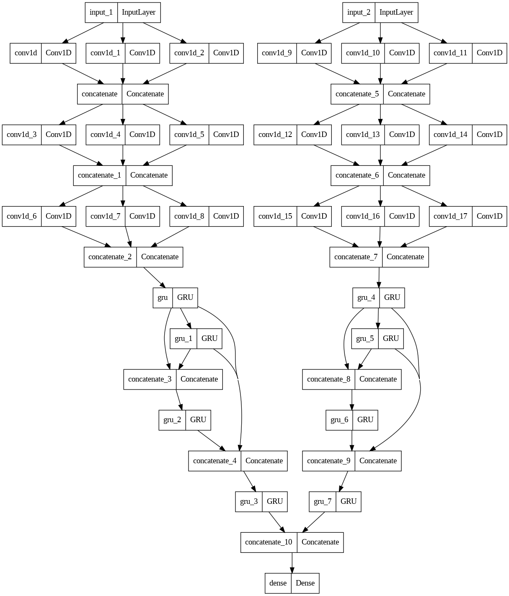
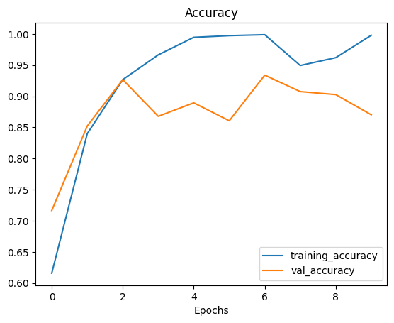

# Attention Deficit Disorder Detection (ADHD)
This model accuracy is Validation 93.39%. This model can predict Attention deficit disorder. Here we are using 19 channels EEG signal to train the model.


## Signal details
* Frequency 128Hz
* 19 Channels ['Fz', 'Cz', 'Pz', 'C3', 'T3', 'C4', 'T4', 'Fp1', 'Fp2', 'F3', 'F4', 'F7', 'F8', 'P3', 'P4', 'T5', 'T6', 'O1', 'O2'].

## Preprocessing the Signals
We used mne package to read and filter the signal. We using two type filter signal data. Then windowing the signal. We cut the signal, where window size 5 seconds no overlaping. This time the same signal goes to all windows in the same group. Spliting the data by group. Scaling the data using Sklearn StandardScaler.
### Filter:
* First dataset (low pass filter=0, high pass filter=60)
* Second dataset (low pass filter=1, high pass filter=30)

# Modeling
Here we used Crononet with some modifications. Our model we used two Crononet. Then combine their output and make it a model. This model take two type of data. First one takes (low pass filter=0, high pass filter=60) and other one takes (low pass filter=1, high pass filter=30) filtered data. Here is the model plot: <br><br><br>
<p>

<p>

## Training model loss and accuracy curves
<p>


<p>

## Confusion Matrix of Train data, Validation data and total dataset

<p>


<p>

# Requirements
* matplotlib 3.5.2
* mne 1.3.0
* numpy 1.23.5
* scikit-learn 1.2.1
* scipy 1.10.0
* tensorflow 2.11.0
* tqdm 4.64.1

# Demo

Here is how to run the potato disease program using the following command line.

## Directories
<pre>
|
├─  adhd_model.py
│
├─env
├─ADHD_DATA
|   ├─ADHD
|   ├─Control
|  
</pre>

Clone code from github
```
git clone git@github.com:HSAkash/Attention-Deficit-Disorder-Detection.git
```
Install requirements
```
pip install -r requirements.txt
```
Run the code
```
python adhd_model.py
```


# Author
HSAkash
* [Linkedin](https://www.linkedin.com/in/hemel-akash/)
* [Kaggle](https://www.kaggle.com/hsakash)
* [Facebook](https://www.facebook.com/hemel.akash.7/)
