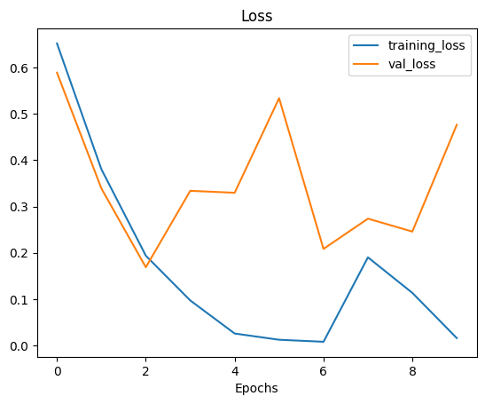

# Attention Deficit Disorder Detection (ADHD)
This model accuracy is Validation (4Sec sample 93.39%, Person 95.83%). This model can predict Attention deficit disorder. Here we are using 19 channels EEG signal to train the model.

## Dataset description
* Total person 121
* ADHD 61 person
* Control 60 person
* Traing person 97 (80%)
* Validation person 24 (20%)
* Validation ADHD 15 person
* Control 9 person
* After 4 seconds windowing Total sample 4173
* Traing 3341 sample (97 person 4 seconds windowing)
* Validation 832 sample (24 person 4 seconds windowing)

## Model Score
### 4 seconds Sample rasults
#### Validation Score
```
___________4 sec Sample validation__________________

 Metrics       Control         ADHD        Average  
____________________________________________________
Precision       0.8796        0.9644        0.9220  
  Recall        0.9326        0.9345        0.9336  
 F1 Score       0.9053        0.9492        0.9273  
 Accuracy       0.9326        0.9345        0.9339  
```
#### Training Score
```
__________4 sec Sample training___________________

 Metrics       Control         ADHD        Average  
____________________________________________________
Precision       1.0000        0.9829        0.9914  
  Recall        0.9801        1.0000        0.9901  
 F1 Score       0.9900        0.9914        0.9907  
 Accuracy       0.9801        1.0000        0.9907  
```
#### Total Score
```
___________4 sec Sample total______________________

 Metrics       Control         ADHD        Average  
____________________________________________________
Precision       0.9803        0.9787        0.9795  
  Recall        0.9729        0.9845        0.9787  
 F1 Score       0.9766        0.9816        0.9791  
 Accuracy       0.9729        0.9845        0.9794  
```
### Person wise Score
```
_________________validation______________________

 Metrics       Control         ADHD        Average  
____________________________________________________
Precision       1.0000        0.9375        0.9688  
  Recall        0.8889        1.0000        0.9444  
 F1 Score       0.9412        0.9677        0.9545  
 Accuracy       0.8889        1.0000        0.9583  
```
#### Training Score
```
_________________Training______________________

 Metrics       Control         ADHD        Average  
____________________________________________________
Precision       1.0000        1.0000        1.0000  
  Recall        1.0000        1.0000        1.0000  
 F1 Score       1.0000        1.0000        1.0000  
 Accuracy       1.0000        1.0000        1.0000  
```
#### Total Score
```
_________________Total______________________

 Metrics       Control         ADHD        Average  
____________________________________________________
Precision       1.0000        0.9839        0.9919  
  Recall        0.9833        1.0000        0.9917  
 F1 Score       0.9916        0.9919        0.9917  
 Accuracy       0.9833        1.0000        0.9917  
```

## Used packages
* `mne` for signal read, filter and windowing(cutting).
* `sklearn` for spliting and scaling.
* `Tensorflow` for modeling.

## Signal details
* Frequency 128Hz
* 19 Channels ['Fz', 'Cz', 'Pz', 'C3', 'T3', 'C4', 'T4', 'Fp1', 'Fp2', 'F3', 'F4', 'F7', 'F8', 'P3', 'P4', 'T5', 'T6', 'O1', 'O2'].

## Preprocessing the Signals
We used mne package to read and filter the signal. We using two type filter signal data. Then windowing the signal. We cut the signal, where window size 4 seconds no overlaping. This time the same signal goes to all windows in the same group. Spliting the data by group. Scaling the data using Sklearn StandardScaler.
### Filter:
* First dataset (low pass filter=0, high pass filter=60)
* Second dataset (low pass filter=1, high pass filter=30)

# Modeling
Here we used Crononet with some modifications. Our model we used two Crononet. Then combine their output and make it a model. This model take two type of data. First one takes (low pass filter=0, high pass filter=60) and other one takes (low pass filter=1, high pass filter=30) filtered data. Here is the model plot: <br><br><br>
<p>

<p>

## Training model loss and accuracy curves
<p>


<p>

## Confusion Matrix of Train data, Validation data and total dataset

<p>


<p>

## Person wise Evaluation using Voting Method

### Confusion Matrix of Train data, Validation data and total dataset

<p>


<p>


# Requirements
* joblib 1.3.1
* matplotlib 3.5.2
* mne 1.3.0
* numpy 1.23.5
* scikit-learn 1.2.1
* scipy 1.10.0
* tensorflow 2.11.0
* tqdm 4.64.1

# Demo

Here is how to run the potato disease program using the following command line.

## Directories
<pre>
|
├─  adhd_model.py
│
├─env
├─ADHD_DATA
|   ├─ADHD
|   ├─Control
|  
</pre>

Clone code from github
```
git clone git@github.com:HSAkash/Attention-Deficit-Disorder-Detection.git
```
Install requirements
```
pip install -r requirements.txt
```
Run the code
```
python adhd_model.py
```


# Author
HSAkash
* [Linkedin](https://www.linkedin.com/in/hemel-akash/)
* [Kaggle](https://www.kaggle.com/hsakash)
* [Facebook](https://www.facebook.com/hemel.akash.7/)
